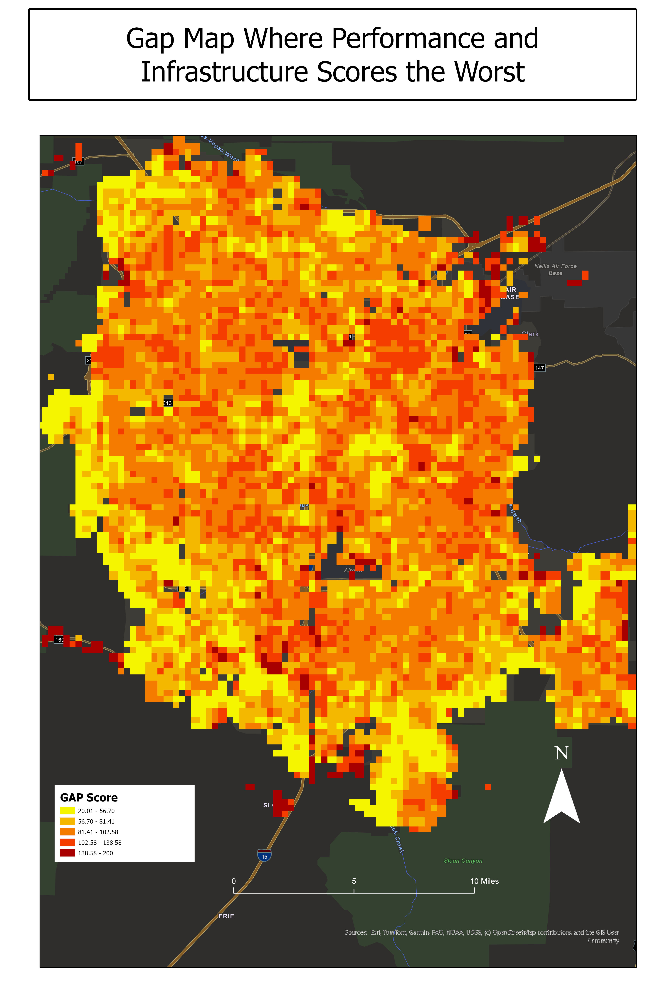
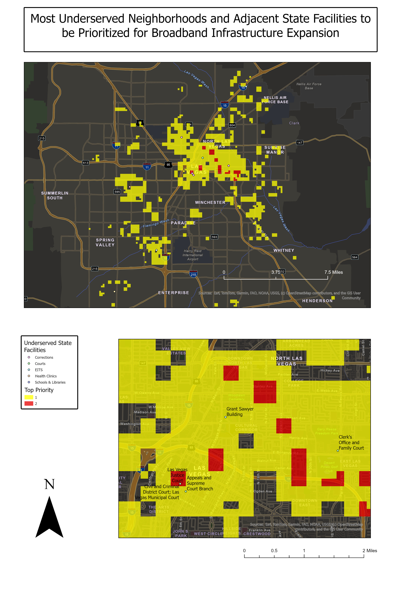
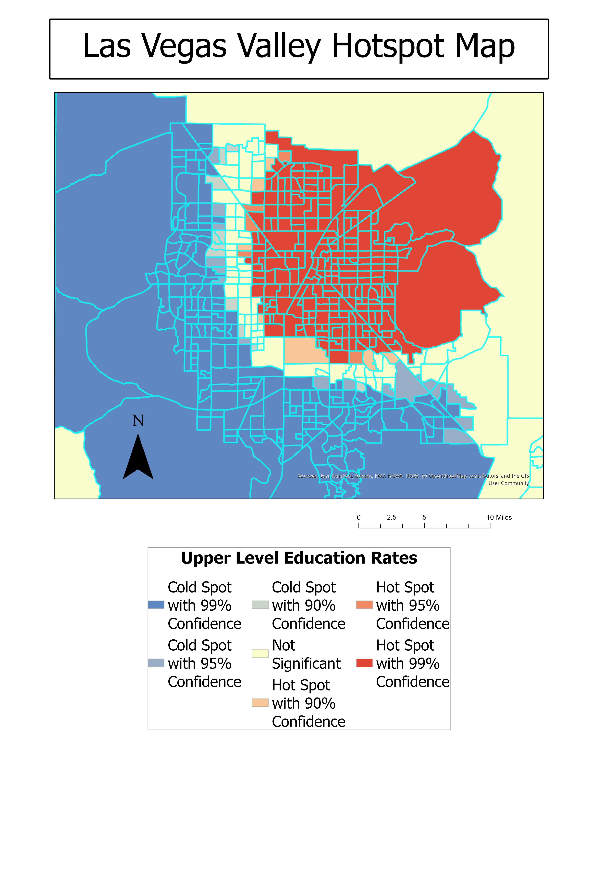
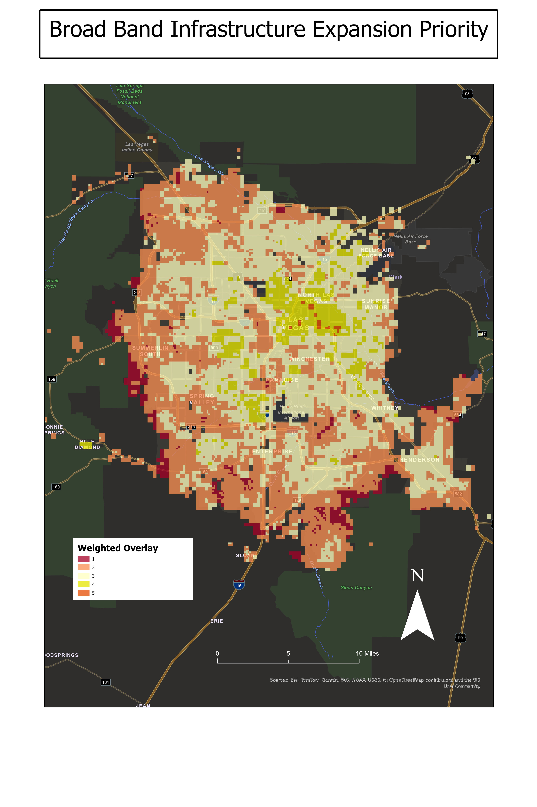

# Las_Vegas_Broadband_Gap_Analysis
Broadband gap analysis when considering broadband infrastructure availability, coverage speeds(Ookla speeds), population characteristics, and underserved state facility prioritization

**Author:** John Hartshorn  
**Software:** ArcGIS Pro  
**Project Type:** GIS-Based Infrastructure & Socioeconomic Analysis  

---

# Project Overview

This project identifies and prioritizes broadband service gaps across the Las Vegas Metropolitan Area using advanced GIS spatial analysis and multi-criteria decision modeling.

As access to high-speed internet becomes increasingly critical for education, workforce development, and public services, disparities in broadband availability contribute to broader socioeconomic inequalities. This study evaluates spatial patterns of broadband performance, infrastructure availability, and population characteristics to identify areas most in need of telecommunications investment.

The analysis demonstrates that broadband accessibility in Clark County is not solely an infrastructure issue, but strongly correlated with socioeconomic factors.

---

# Research Question

Where are the most significant broadband service gaps in the Las Vegas Metropolitan area with respect to internet performance, broadband infrastructure availability, and population characteristics, and which locations should be prioritized for telecommunications investment?

---

# Study Area

The study focuses on **Clark County, Nevada**, one of the fastest-growing metropolitan regions in the United States, with a population nearing 2.5 million.

Key regional characteristics:

- Rapid urban growth  
- High population density in urban cores  
- Large public school system (5th largest in the U.S.)  
- Increasing reliance on digital infrastructure  

---

# Data Sources

| Dataset | Source |
|--------|--------|
| Broadband Performance (Ookla) | Nevada Governor’s Office of Science, Innovation, and Technology |
| Broadband Infrastructure | Nevada OSIT |
| State Facilities Without Fiber | Nevada OSIT |
| Population Data (2020) | U.S. Census Bureau |
| Educational Attainment | U.S. Census Bureau |
| Critical Infrastructure | Clark County GIS |
| Land Use | USGS |

---

# Methodology

## Data Preprocessing

All datasets were standardized using geoprocessing tools in ArcGIS Pro:

- Reprojected to **NAD83 Nevada State Plane (US Feet)**
- Clipped to study area
- Normalized using a **1,500 ft × 1,500 ft fishnet grid**

The fishnet grid ensures consistent spatial units and reduces bias from irregular geometries such as census blocks.

---

## Broadband Gap Scoring

Two primary metrics were calculated:

- **Infrastructure Score (1–100)**  
  Higher scores indicate lower broadband infrastructure availability  

- **Performance Score (1–100)**  
  Higher scores indicate slower internet speeds  

These were combined into a:

- **Broadband Gap Score**

Higher values represent areas with both poor infrastructure and poor performance.

---

## Spatial Analysis Workflow

The analysis integrates multiple datasets through:

- Spatial Join  
- Field Calculations  
- Reclassification  
- Feature to Raster conversion  

All variables were normalized to a common scale for comparison.

---

## Weighted Overlay Model

A multi-criteria decision analysis was performed using weighted overlay.

| Factor | Weight |
|------|------|
| Broadband Gap Score | 30% |
| State Facilities Without Fiber | 25% |
| Educational Attainment | 20% |
| Population Density | 10% |
| Critical Infrastructure | 10% |
| Slope | 5% |

The result is a **priority surface identifying optimal areas for broadband investment**.

---

## Hotspot Analysis

A **Getis-Ord Gi\*** hotspot analysis was conducted on educational attainment to identify statistically significant clusters of low education levels.

This output was compared with broadband gap results to evaluate spatial correlation.

---

# Results

The analysis reveals clear spatial disparities in broadband access across the Las Vegas Metropolitan Area.

Key findings:

- High-priority zones are concentrated in **North Las Vegas**
- These areas exhibit:
  - High population density  
  - Low educational attainment  
  - Limited fiber infrastructure  
  - Poor broadband performance  

The overlap between infrastructure gaps and socioeconomic indicators highlights areas where investment would yield the greatest impact.

---

# Maps

## Broadband Gap Score

## Weighted Overlay Priority Map

## Education Hotspot Analysis

## Final Priority Zones

---

# Workflow

---

# Key Insights

- Broadband inequality is strongly linked to socioeconomic factors  
- Infrastructure gaps are geographically clustered, not random  
- North Las Vegas represents the highest priority for investment  
- Expanding fiber access in these areas would benefit both communities and public institutions  

---

# Skills Demonstrated

### Advanced GIS Analysis

- Multi-criteria decision analysis (MCDA)
- Weighted overlay modeling
- Hotspot analysis (Getis-Ord Gi*)
- Spatial normalization using fishnet grids

### Data Processing

- Spatial joins
- Field calculations
- Raster conversion
- Reclassification

### GIS Tools

- ArcGIS Pro
- Spatial Analyst
- Statistical analysis tools

---

# Project Significance

This project demonstrates how GIS can be used to address real-world infrastructure challenges by integrating technical, environmental, and socioeconomic data.

The results provide actionable insights for:

- telecommunications planners  
- local government agencies  
- infrastructure investment strategies  

Targeted broadband expansion in identified priority zones could significantly improve:

- educational access  
- workforce opportunities  
- digital equity  

---

# Conclusion

Broadband service gaps in the Las Vegas Metropolitan Area are not randomly distributed, but strongly correlated with socioeconomic disparities.

By prioritizing high-need areas identified in this analysis, policymakers and stakeholders can maximize the impact of infrastructure investments and support long-term community development.

---
